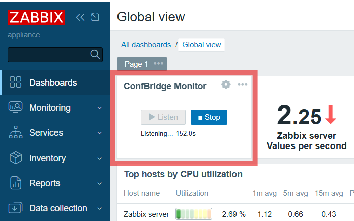

# ConfBridge Monitor — Zabbix Widget

> 🌐 [日本語版はこちら](README.ja.md)

A Zabbix 7.0+ custom widget that lets you listen to Asterisk ConfBridge audio directly in your browser — no SIP client, no WebRTC stack, no extra software required.



## Overview

Operations teams that already use Zabbix dashboards can monitor Asterisk conference bridge audio without installing any additional client software. The widget connects to Asterisk via WebSocket, decodes Opus audio using a WebAssembly decoder, and plays it through the Web Audio API — all within the Zabbix dashboard page.

**Key design decisions:**

- Works on plain HTTP (no TLS required) — WebCodecs API is intentionally avoided because it requires a Secure Context
- Uses two separate WebSockets as required by Asterisk: one for ARI control events, one for media frames
- REST calls (POST/DELETE) to Asterisk are proxied through a PHP action in the module — `fetch()` is subject to browser CORS enforcement, so direct cross-origin REST calls are blocked. WebSocket connections are not subject to CORS and go directly from the browser to Asterisk; origin validation is handled server-side by Asterisk's `allowed_origins` setting

## Requirements

| Component | Version |
|-----------|---------|
| Zabbix | 7.0, 7.2, or 7.4 |
| Asterisk | 22.8.0+ or 23.2.0+ |
| Browser | Any modern browser (Chrome, Firefox, Edge) |

> Asterisk must have `chan_websocket` and `res_ari` modules loaded.  
> Both Zabbix and Asterisk must be served over plain HTTP (mixed content rules apply).

## Installation

### 1. Copy the module to Zabbix

```bash
cp -r module/ /usr/share/zabbix/modules/cbm_monitor
```

> The directory name must not contain `conf` followed by a non-dot character — Zabbix's default nginx config blocks such paths. `cbm_monitor` is safe.

### 2. Register the module in Zabbix

1. Go to **Administration → General → Modules**
2. Click **Scan directory**
3. Find **ConfBridge Monitor** and click **Enable**

### 3. Configure Asterisk

See [docs/asterisk-setup.md](docs/asterisk-setup.md) for step-by-step instructions (FreePBX GUI).

Required settings:

- ARI enabled (`enabled = yes`)
- HTTP server listening on `0.0.0.0:8088`
- An ARI user with `read_only = no`
- `allowed_origins` includes your Zabbix server's origin (or `*` for internal use)

### 4. Add the widget to a dashboard

1. Edit a dashboard → **Add widget** → select **ConfBridge Monitor**
2. Fill in:
   - **Asterisk Host (browser)** — address the browser uses for WebSocket connections to Asterisk
   - **Asterisk Host (server-side proxy)** — address the Zabbix server uses for REST calls to Asterisk via PHP. Leave blank if the same as the browser-facing address (typical LAN setup)
   - **ARI Port** — default `8088`
   - **ARI Username / Password** — credentials of the ARI user
   - **Bridge ID** — the ConfBridge name (e.g. `8000`)
   - **Buffer (ms)** — jitter buffer size; `100` works well on LAN
3. Save and click **▶ Listen**

## Content Security Policy

If your Zabbix web server has a CSP header, add the Asterisk origin to `connect-src`:

```
Content-Security-Policy: connect-src 'self' ws://192.168.x.x:8088;
```

See [docs/zabbix-setup.md](docs/zabbix-setup.md) for details.

## Architecture

### Communication paths

Three parties are involved: the operator's **Browser**, the **Zabbix Server**, and the **Asterisk Server**.

```
[Browser]                    [Zabbix Server]           [Asterisk Server :8088]
    │                              │                            │
    │── ① HTTP (Zabbix UI) ───────►│                            │
    │                              │                            │
    │── ② ws:// ARI events ────────┼───────────────────────────►│
    │                              │                            │
    │── ③ ws:// Media (Opus) ──────┼───────────────────────────►│
    │                              │                            │
    │── ④ HTTP (AriProxy) ────────►│── ⑤ HTTP curl (ARI REST) ►│
    │      POST/DELETE via PHP     │                            │
```

| Path | From | To | Purpose |
|------|------|----|---------|
| ① | Browser | Zabbix Server :80 | Zabbix dashboard (already required) |
| ② | Browser | Asterisk :8088 | ARI events WebSocket (direct) |
| ③ | Browser | Asterisk :8088 | Media WebSocket — Opus frames (direct) |
| ④ | Browser | Zabbix Server :80 | REST calls via PHP proxy (avoids CORS) |
| ⑤ | Zabbix Server | Asterisk :8088 | PHP proxy forwards REST to Asterisk |

WebSocket connections (② ③) go **directly from the browser to Asterisk** — they cannot be proxied through Zabbix because WebSocket is a long-lived connection and CORS does not apply to WebSocket.

REST calls (POST/DELETE) **cannot go directly** from the browser to Asterisk due to CORS, so they are forwarded by the PHP `AriProxy` action running on the Zabbix server.

### Widget config fields and their scope

Because the browser and the Zabbix server may reach Asterisk at different addresses (e.g. when NAT or a reverse proxy sits between them), two separate host fields are provided:

| Field | Used by | Purpose |
|-------|---------|---------|
| **Asterisk Host (browser)** | Browser (JavaScript) | WebSocket URLs for ARI events and media |
| **Asterisk Host (server-side proxy)** | Zabbix Server (PHP curl) | REST calls forwarded by AriProxy |

Leave **Asterisk Host (server-side proxy)** blank when both addresses are the same — the common case on a flat LAN.

### Required network connectivity

| Connection | Port | Protocol |
|------------|------|----------|
| Browser → Zabbix Server | 80 | HTTP |
| Browser → Asterisk Server | 8088 | WebSocket (ws://) |
| Zabbix Server → Asterisk Server | 8088 | HTTP |

## Known Limitations

- **StasisStart timeout** — If the browser is force-closed while listening and a reconnect is attempted immediately, a `StasisStart timeout (10s)` error may occur. The orphaned channel is automatically cleaned up; simply press Listen again.
- **Plain HTTP only** — Moving to HTTPS requires enabling TLS on Asterisk as well (`wss://`).

## License

MIT — see [LICENSE](LICENSE).

Dependencies:

- [`opus-decoder`](https://github.com/eshaz/wasm-audio-decoders) (MIT) — WASM Opus decoder
